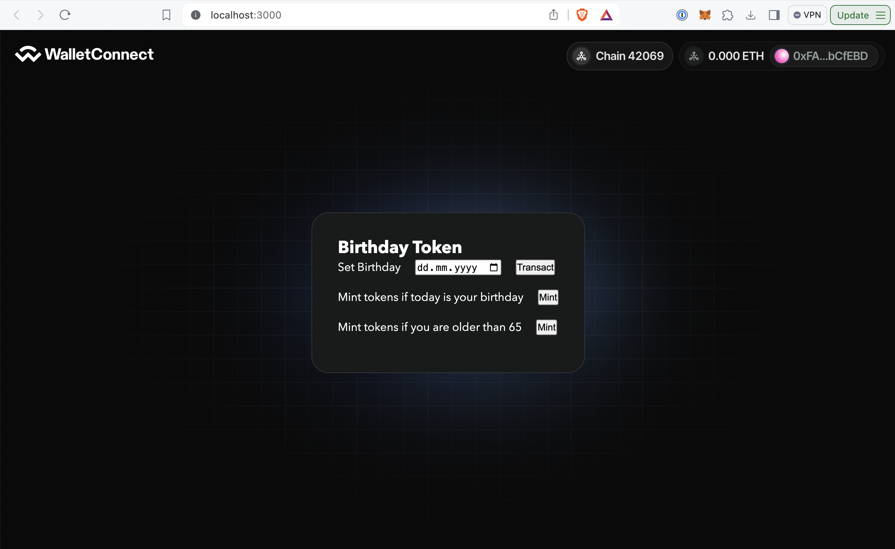

# Birthday Token Mint

## Description
This project securely encrypts and stores your birthday data on the blockchain, allowing decentralized applications (dApps) to verify your age or birthday without exposing your actual birth date.

## Usage
1. Mint your birthday, this function stores your birthday fully encrypted onchain in the contract state
2. Mint Birthday token if today is your birthday! 

## Technologies Used
- FHE.sol
- Fhenix.js
- WalletConnect

## Contributing
This project is part of the Hackerhouse Fhenix hosted at ETH Denver 2024, thanks a lot for hosting me!

## License
MIT License
